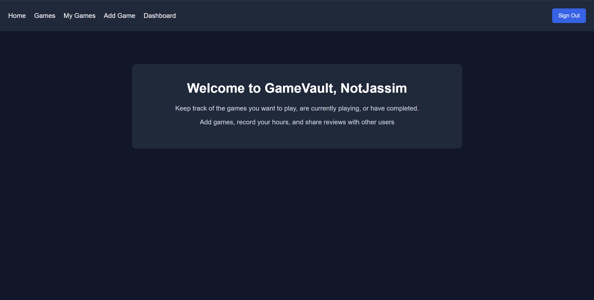
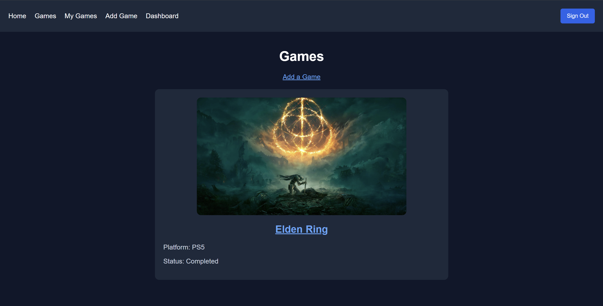
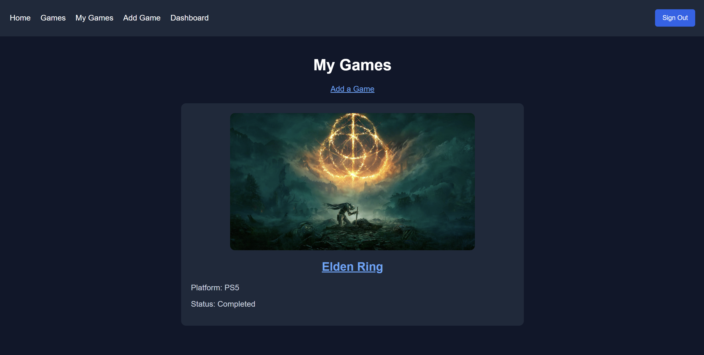
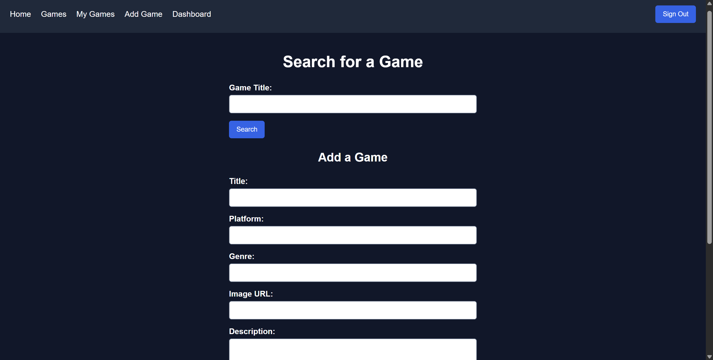
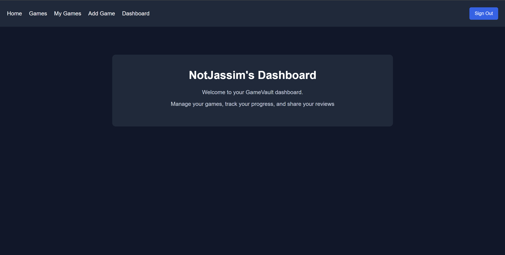
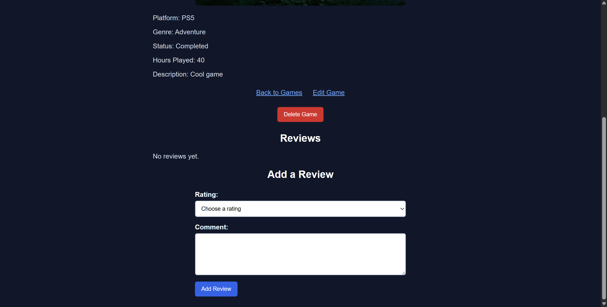

# GameVault

GameVault is a video game tracking app made with Node.js, Express, EJS, MongoDB, and CSS

Users can create an account and add games to their collection. They can record the platform, genre, playing status, hours played, description, and game image. Games can also be set as public or private

Users can search for games using the RAWG API. The game title and image are automatically added to the Add Game form

Users can add ratings and reviews to games. They can edit or delete the games and reviews that they created

I chose GameVault because I enjoy video games and wanted to create an app that helps users keep track of the games they want to play, are currently playing, or have completed

## Screenshots

### Home

### Games

### My Games

### Add Game

### Dashboard

### Edit and Delete Reviews

## Getting Started

### Use GameVault

[Open GameVault](https://gamevault-y35u.onrender.com)

### Planning Materials

[GameVault Trello Board](https://trello.com/c/5GI0wocH)

## How to Use the App

Create an account or sign in

Open the Games page to view public games

Click Add Game to add a new game

Search for a game using the search form

Select a game to automatically fill the title and image

Enter the remaining game information and choose whether it is public or private

Open My Games to view the games you created

Click a game to view its details

Edit or delete a game that you created

Add a rating and review to a game

Edit or delete a review that you created

Sign out when you are finished

## Installation

Clone the repository and install the project packages.

git clone https://github.com/Jassiiimm/GameVault.git

cd GameVault

npm install

npm start

A .env file is also required with the MongoDB connection, session secret, and RAWG API key

## Technologies Used

HTML

CSS

JavaScript

Node.js

Express

EJS

MongoDB

Mongoose

bcrypt

Express Session

Connect Mongo

Method Override

RAWG API

## Attributions

Game information and images are provided by RAWG

## Future Enhancements

Allow users to filter games by platform, genre, or status

Allow users to upload game images

Display the average rating for each game

Improve the design for smaller screens

## Credits

Thanks to my GA instructor Nabila Ayaba, and my IAs Bidoor Almannaei and Zainab Fadhel for helping and giving feedback during the project

## Contributing

This project was made for my Unit 2 project

## License

No license added